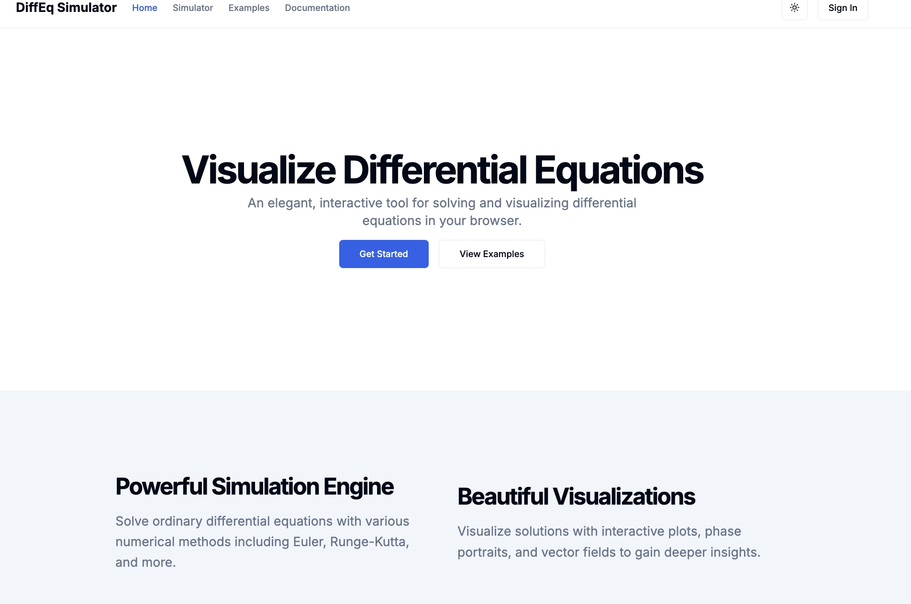
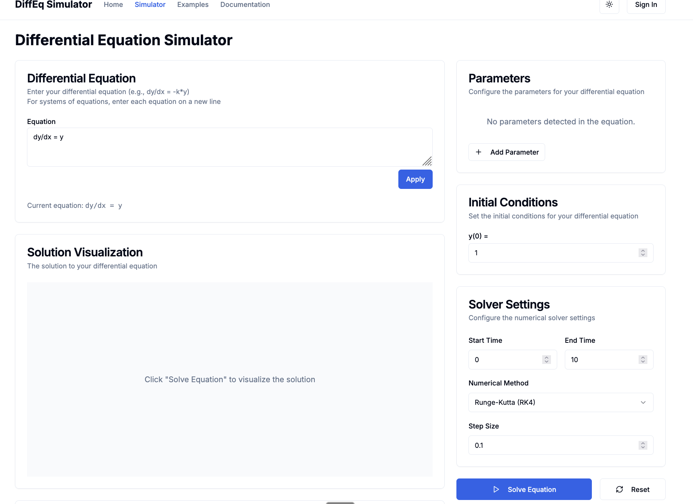

# Differential Equation Simulator

A web-based differential equation simulator built with Next.js and React. This application allows users to input, solve, and visualize differential equations in real-time.

Generated by [Deepak Vaid](https://github.com/deepakvaid) using [v0.dev](https://v0.dev)



## Features

- Interactive equation input system
- Real-time solution visualization
- Phase portrait generation
- Support for various types of differential equations:
  - First-order systems
  - Second-order equations
  - Systems of equations
- Configurable solver settings
- Initial conditions customization
- Example equations library
- Responsive design for all devices

## Tech Stack

- [Next.js](https://nextjs.org/) - React framework for production
- [React](https://reactjs.org/) - UI library
- [TypeScript](https://www.typescriptlang.org/) - Type safety
- [Tailwind CSS](https://tailwindcss.com/) - Styling
- Custom differential equation solvers
- Interactive plotting and visualization

## Getting Started

1. Clone the repository
2. Install dependencies:
   ```bash
   pnpm install
   ```
3. Run the development server:
   ```bash
   pnpm dev
   ```
4. Open [http://localhost:3000](http://localhost:3000) in your browser

## Usage



1. Navigate to the simulator page
2. Enter your differential equation in the input field
3. Configure initial conditions and parameters
4. Adjust solver settings if needed
5. View the solution plot and phase portrait in real-time

## Project Structure

- `/app` - Next.js application routes and pages
- `/components` - React components including UI elements
- `/context` - React context providers
- `/hooks` - Custom React hooks
- `/lib` - Core solver implementations and utilities
- `/public` - Static assets
- `/styles` - Global styles
- `/types` - TypeScript type definitions

## Credits

- Built by Deepak Vaid
- UI components generated using [v0.dev](https://v0.dev)
- Built with [Next.js](https://nextjs.org/)